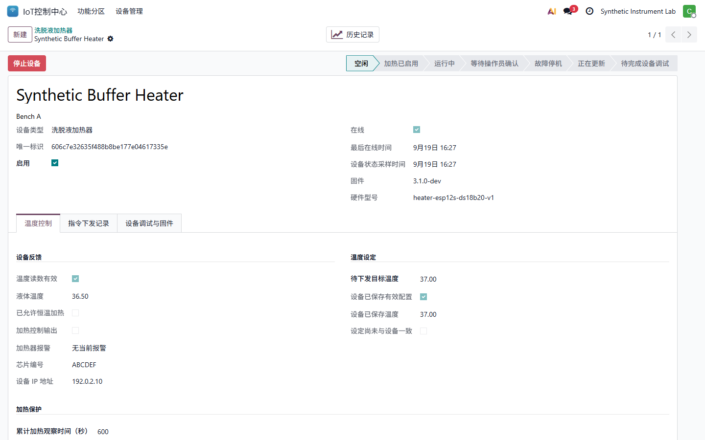
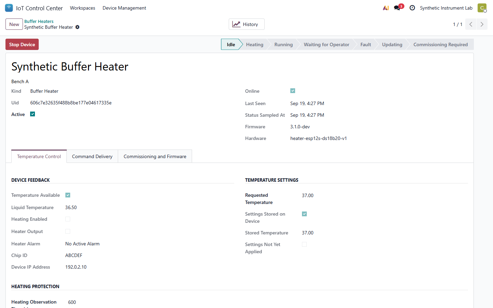
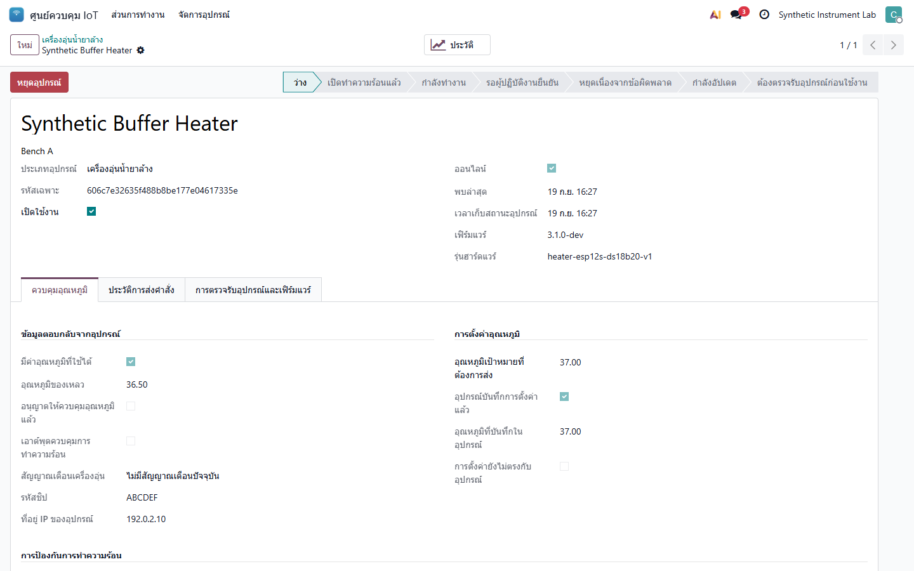

# IoT 19.0.2.1.1 User Guide

## zh_CN

### 运行总览与继电器

总览现在包含继电器、温湿度、考勤、网络、洗脱液加热器和洗脱仪六个功能分区。页面内容超出窗口时可在内容区域向下滚动。

继电器的“定时执行条件”与“定时同步成功”不同。“已禁止自动开启”表示设备的保护锁阻止自动开机；同步计划不会解锁。“状态已过期”不是实时确认。请先检查设备，再决定是否在现场或平台明确启用，不能把显示修复当作解除保护。

### 洗脱液加热器

先由管理员登记设备和令牌并完成实物调试。在设备页修改“待下发目标温度”，保存后点击“下发温度设置”。等待设备确认，核对“设备已保存温度”与待下发值一致；仅保存平台表单不代表设备已应用。

设备只有一只液温探头，没有液位传感器。目标温度及保护参数保存在设备本地，离线仍可使用；下发不启动加热。SW1 显示芯片编号和 IP，SW2 启停，SW3 显示已保存设定。报警后须现场检查，长按 SW2 确认后仍需另行启用。

默认保护为累计实际加热 600 秒，温升小于 1 C 时停机报警；恰好 1 C 不触发此报警。探头断线、异常或过期读数也停止加热。温升不足不等同于已确认缺液，软件保护不能替代独立过温断电装置。

历史记录按设备查看原始采样或小时趋势。普通离线样本采用有限滚动缓存，被覆盖的数量会显示；报警和命令回执不静默覆盖。“加热控制输出”不是独立的功率或实际升温测量。

### 洗脱仪与发布边界

程序在平台编制、发布并下发，设备空闲时接收，本地确认启动及继续。注液和排液按时间控制，温度仅监测。当前固件只保存一个当前程序；开机归零后排液、多程序本地选择和按循环数编程仍待实现，不能将定时步骤当作这些功能。

本次发布平台和通信桥接，不刷写任何设备、不解除继电器保护、不改变网关公司/IP 绑定。设备 OTA、首次有线迁移和 SD 升级仍需实机验收。以后服务器测试使用 imytestth 的隔离库，不使用生产业务库或 imytestlan。

## en_US

### Overview and Relays

The overview has six workspaces: relays, environment, attendance, network, buffer heaters and array washers. Scroll within the content area to reach lower sections.

Schedule Execution is separate from successful schedule synchronization. Automatic ON blocked means the device's lock prevents automatic startup; resending a schedule does not unlock it. Status out of date is not live confirmation. Inspect the equipment before an explicit enable action. A display fix does not release protection.

### Buffer Heaters

An administrator must register the device/token and complete physical commissioning first. Change Requested Temperature, save, then select Send Temperature Settings. Wait for device confirmation and compare Stored Temperature with the request. Saving the platform form alone does not apply it to the device.

There is one liquid-temperature probe and no level sensor. Targets and protection settings persist locally for offline use; downloading does not start heating. SW1 shows chip ID/IP, SW2 starts/stops, and SW3 shows stored settings. After an alarm, inspect locally and hold SW2 to acknowledge; enabling is a separate action.

The default alarm stops heating when the rise is less than 1 C after 600 seconds of actual heating. Exactly 1 C does not trigger this alarm. Disconnected, invalid or stale probe readings also stop heating. Insufficient rise does not prove an empty vessel, and software cannot replace an independent overtemperature cutoff.

History provides raw samples and hourly trends by instrument. Ordinary offline samples have a bounded rolling buffer with a visible overwrite count; alarms and command receipts are not silently overwritten. Heater Output is a controller signal, not independent measurement of power or heat.

### Array Washers and Release Limits

Create, release and send programs on the platform. Devices accept programs while idle and require local Start/Continue. Filling and draining are timed; temperature is monitored only. Current firmware stores one current program. Startup home-and-drain, local multi-program selection and explicit cycle-count programming remain unfinished; timed steps are not equivalent.

This release updates the platform and bridge only. It does not flash devices, release relay locks or rebind gateway/company IPs. Physical OTA, first wired migration and SD-update acceptance remain pending. Future server tests use isolated databases on imytestth, not the live business database or imytestlan.

## th_TH

### ภาพรวมและรีเลย์

หน้าภาพรวมมีหกส่วน ได้แก่ รีเลย์ สภาพแวดล้อม การลงเวลา เครือข่าย เครื่องอุ่นน้ำยาล้าง และเครื่องล้างสไลด์ หากเนื้อหาเกินขนาดหน้าต่าง ให้เลื่อนลงภายในพื้นที่เนื้อหา

เงื่อนไขการทำงานตามเวลาแยกจากสถานะซิงค์ตารางเวลา ข้อความ “ระงับการเปิดอัตโนมัติ” หมายถึงอุปกรณ์ยังล็อกการเริ่มทำงาน การส่งตารางเวลาใหม่ไม่ปลดล็อก ส่วนสถานะที่ไม่เป็นปัจจุบันไม่ใช่การยืนยันสภาพขณะนี้ ต้องตรวจสอบอุปกรณ์ก่อนสั่งเปิด การแก้ไขหน้าจอไม่ได้ปลดระบบป้องกัน

### เครื่องอุ่นน้ำยาล้าง

ผู้ดูแลต้องลงทะเบียนอุปกรณ์และโทเคน พร้อมตรวจรับฮาร์ดแวร์ก่อนใช้งาน แก้ไขอุณหภูมิเป้าหมาย บันทึก แล้วกดส่งการตั้งค่า รออุปกรณ์ยืนยันและตรวจว่าอุณหภูมิที่บันทึกในอุปกรณ์ตรงกับค่าที่ต้องการ การบันทึกแบบฟอร์มอย่างเดียวไม่ได้ทำให้อุปกรณ์รับค่าแล้ว

อุปกรณ์มีเซ็นเซอร์อุณหภูมิของเหลวหนึ่งตัว ไม่มีเซ็นเซอร์ระดับของเหลว ค่าเป้าหมายและค่าป้องกันถูกเก็บในอุปกรณ์เพื่อใช้งานออฟไลน์ การดาวน์โหลดค่าไม่เริ่มทำความร้อน SW1 แสดงรหัสชิปและ IP, SW2 ใช้เปิดหรือหยุด และ SW3 แสดงค่าที่บันทึก หลังเกิดสัญญาณเตือนต้องตรวจสอบที่เครื่อง กด SW2 ค้างเพื่อรับทราบ แล้วจึงสั่งเปิดแยกอีกครั้ง

ค่าป้องกันเริ่มต้นจะหยุดทำความร้อนเมื่ออุณหภูมิเพิ่มขึ้นน้อยกว่า 1 C หลังสะสมเวลาที่เปิดทำความร้อนจริงครบ 600 วินาที หากเพิ่มขึ้นเท่ากับ 1 C จะไม่แจ้งเตือนกรณีนี้ เซ็นเซอร์ขาด ค่าผิดปกติ หรือข้อมูลเก่าก็ทำให้หยุดเช่นกัน อุณหภูมิขึ้นช้าไม่ได้ยืนยันว่าของเหลวหมด และซอฟต์แวร์ทดแทนอุปกรณ์ตัดความร้อนอิสระไม่ได้

ประวัติแสดงตัวอย่างดิบและแนวโน้มรายชั่วโมงแยกตามอุปกรณ์ ตัวอย่างออฟไลน์ทั่วไปมีบัฟเฟอร์แบบวนทับที่จำกัดและแสดงจำนวนที่ถูกเขียนทับ สัญญาณเตือนและใบตอบรับคำสั่งไม่ถูกเขียนทับเงียบ ๆ เอาต์พุตควบคุมความร้อนเป็นเพียงสัญญาณควบคุม ไม่ใช่ผลวัดกำลังไฟหรือความร้อนจริง

### เครื่องล้างสไลด์และขอบเขตการอัปเดต

จัดทำ เผยแพร่ และส่งโปรแกรมจากแพลตฟอร์ม อุปกรณ์รับโปรแกรมขณะว่าง และต้องยืนยันเริ่มหรือทำต่อที่หน้าจอ การเติมและระบายของเหลวใช้เวลา อุณหภูมิใช้ตรวจวัดเท่านั้น เฟิร์มแวร์ปัจจุบันเก็บโปรแกรมที่ใช้งานอยู่หนึ่งโปรแกรม ส่วนการกลับจุดเริ่มต้นแล้วระบายเมื่อเปิดเครื่อง การเลือกหลายโปรแกรมในเครื่อง และการกำหนดจำนวนรอบยังไม่เสร็จ ขั้นตอนแบบตั้งเวลาไม่ใช่คุณสมบัติเหล่านี้

การอัปเดตครั้งนี้ครอบคลุมแพลตฟอร์มและบริดจ์เท่านั้น ไม่แฟลชอุปกรณ์ ไม่ปลดล็อกรีเลย์ และไม่เปลี่ยนการผูก IP เกตเวย์กับบริษัท การตรวจรับ OTA การย้ายเฟิร์มแวร์ครั้งแรกผ่านสาย และการอัปเดต SD บนเครื่องจริงยังต้องดำเนินการ การทดสอบเซิร์ฟเวอร์ต่อไปใช้ฐานข้อมูลแยกบน imytestth ไม่ใช้ฐานข้อมูลธุรกิจจริงหรือ imytestlan
