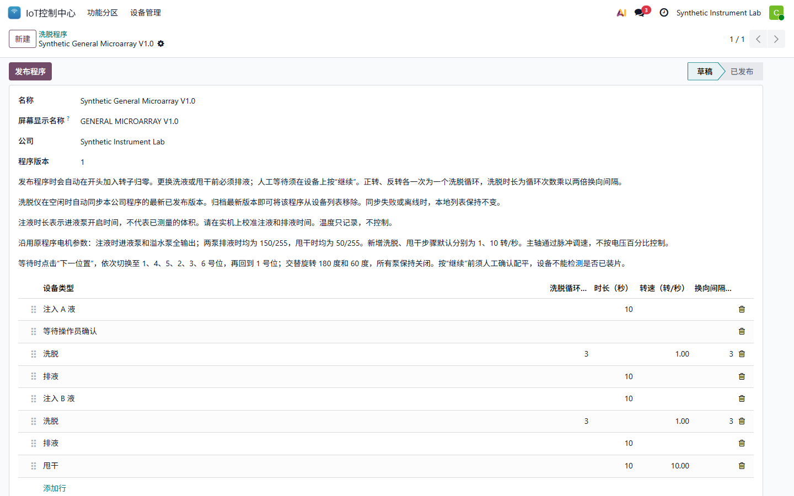
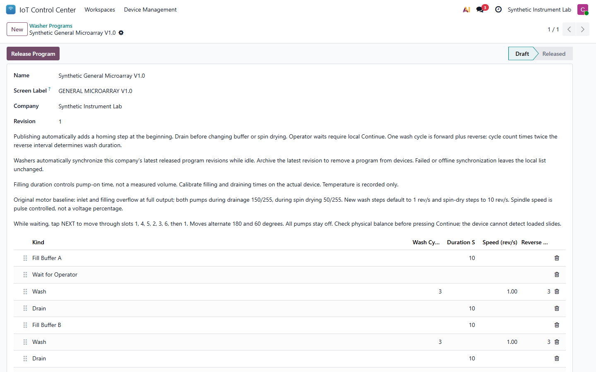
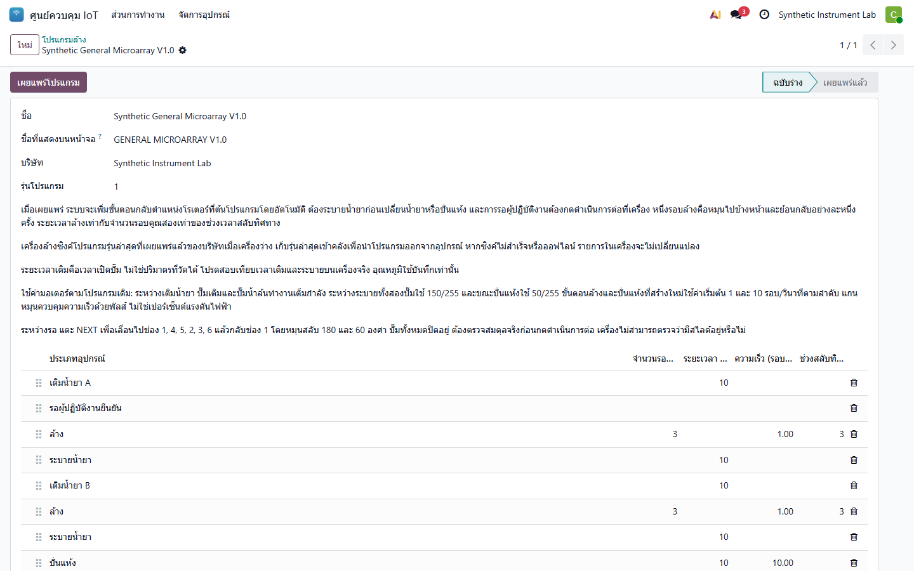

# IoT Control Center 19.0.2.2.0 User Guide

## zh_CN

### 洗脱仪程序

在 **IoT 控制中心 > 洗脱仪程序** 新建草稿，按实际工艺依次增加注入 A、人工等待、洗脱、排液、注入 B、洗脱、排液和甩干等步骤。洗脱步骤填写循环次数；一次循环包含一次正转和一次反转。发布时平台会自动在设备程序开头加入安全归零，操作员不需要手工添加。

发布后，空闲且已注册的洗脱仪自动同步公司当前全部已发布程序。新版本替换同一程序的旧版本，归档最新版本会从设备删除该程序；断网、校验失败或保存失败时保持设备现有本地列表不变。同步、下载和人工等待都不会自动启动或继续运行，必须在设备屏幕确认。

### 洗脱液加热器

平台下发并记录目标温度、600 秒温升窗口和 1 C 最小温升；设置保存在设备上供离线使用。远程只能设置、停止或请求签名 OTA，不能启动加热。加热必须由设备 SW2 本地启用。探头故障或累计实际加热 600 秒温升小于 1 C 时，设备停止输出并锁定报警；恰好 1 C 不触发该报警。

### 安全边界

软件验证不等于负载、泵量、转向、停止距离或独立过温保护验收。首次启用前必须完成现场 commissioning；洗脱仪当前保持未配置、未绑定平台和全部输出关闭。

## en_US

### Washer Programs

Create a draft under **IoT Control Center > Washer Programs** and add the real process steps in order, such as Fill A, operator wait, wash, drain, Fill B, wash, drain and spin dry. A wash cycle is one forward and one reverse movement. Publishing automatically prepends a safe homing step, so operators do not add it manually.

An idle, registered washer synchronizes the company's complete released catalog. A new revision replaces the prior revision and archiving the latest revision removes that program. Offline, invalid or failed synchronization keeps the current local catalog. Synchronization, downloading and operator waits never start or continue motion automatically; confirmation remains local.

### Buffer Heater

The platform sends and records the target, 600-second rise window and 1 C minimum rise. Settings persist for offline use. Remote actions may configure, stop or request signed OTA, but cannot start heating; SW2 is the local enable. A probe fault or a rise below 1 C during 600 seconds of accumulated active heating stops the output and latches the alarm. Exactly 1 C does not trigger it.

### Safety Boundary

Software verification is not loaded-heater, pump-flow, direction, stopping-distance or independent thermal-cutoff acceptance. Complete onsite commissioning before enabling outputs. The tested washer remains uncommissioned, unenrolled and with every output off.

## th_TH

### โปรแกรมเครื่องล้าง

สร้างฉบับร่างที่ **IoT Control Center > Washer Programs** แล้วเพิ่มขั้นตอนจริงตามลำดับ เช่น เติม A รอผู้ปฏิบัติงาน ล้าง ระบาย เติม B ล้าง ระบาย และปั่นแห้ง หนึ่งรอบล้างประกอบด้วยหมุนไปข้างหน้าและย้อนกลับอย่างละหนึ่งครั้ง เมื่อเผยแพร่ แพลตฟอร์มจะเพิ่มขั้นตอนกลับตำแหน่งที่ต้นโปรแกรมให้อัตโนมัติ

เครื่องที่ว่างและลงทะเบียนแล้วจะซิงค์รายการโปรแกรมที่เผยแพร่ทั้งหมดของบริษัท รุ่นใหม่จะแทนรุ่นเดิม และการเก็บรุ่นล่าสุดเข้าคลังจะนำโปรแกรมออก หากออฟไลน์ ตรวจสอบไม่ผ่าน หรือบันทึกไม่สำเร็จ เครื่องจะคงรายการเดิมไว้ การซิงค์ ดาวน์โหลด และการรอผู้ปฏิบัติงานจะไม่เริ่มหรือทำงานต่อเอง ต้องยืนยันที่เครื่อง

### เครื่องอุ่นน้ำยาล้าง

แพลตฟอร์มส่งและบันทึกอุณหภูมิเป้าหมาย ช่วงตรวจ 600 วินาที และอุณหภูมิที่ต้องเพิ่มอย่างน้อย 1 C ค่าจะเก็บในเครื่องเพื่อใช้ออฟไลน์ คำสั่งระยะไกลตั้งค่า หยุด หรือขอ OTA ที่ลงนามได้ แต่เริ่มทำความร้อนไม่ได้ ต้องเปิดใช้จาก SW2 ที่เครื่อง หากหัววัดขัดข้องหรืออุณหภูมิเพิ่มน้อยกว่า 1 C ระหว่างเวลาทำความร้อนสะสม 600 วินาที เครื่องจะหยุดและค้างสัญญาณเตือน ค่าเท่ากับ 1 C ไม่ทำให้เกิดสัญญาณนี้

### ขอบเขตความปลอดภัย

การทดสอบซอฟต์แวร์ไม่ใช่การตรวจรับโหลดทำความร้อน อัตราการไหล ทิศทาง ระยะหยุด หรือระบบตัดความร้อนอิสระ ต้อง commissioning หน้างานก่อนเปิดเอาต์พุต เครื่องล้างที่ทดสอบยังไม่ commissioning ไม่ผูกกับแพลตฟอร์ม และเอาต์พุตทั้งหมดปิดอยู่
