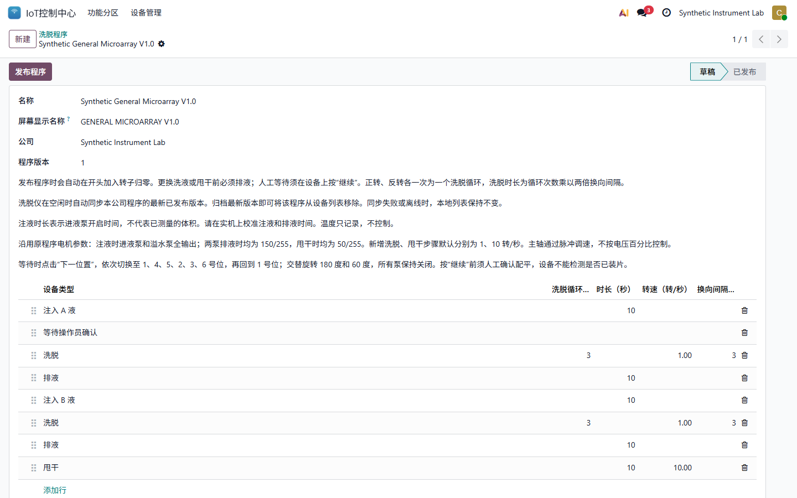
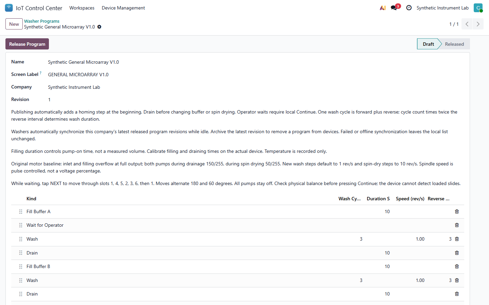
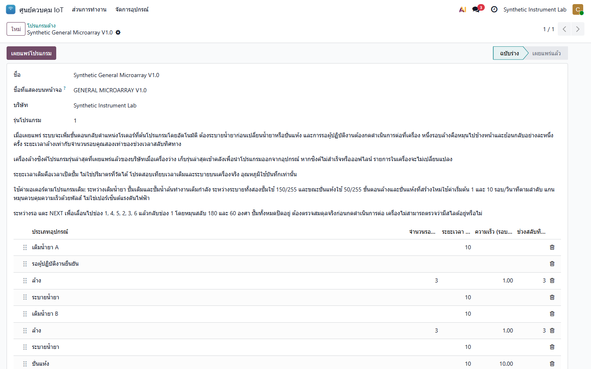

# IoT Control Center 19.0.2.3.0 User Guide

## zh_CN

### 洗脱仪程序

在 **IoT 控制中心 > 洗脱仪程序** 新建草稿并按实际工艺添加注液、人工等待、洗脱、排液和甩干步骤。发布时平台自动在开头加入安全归零，操作员无需手工添加。一次洗脱循环包含一次正转和一次反转。

空闲且已注册的洗脱仪会同步公司当前完整的已发布程序目录；新增、修改、归档删除均以平台为准。同步失败或断网时保留设备现有本地目录，不会清空程序。日常程序通常不超过三个，但系统不把三个作为固定上限；单次目录最多 64 个程序。

设备屏幕仅使用英文。新版界面采用深蓝顶栏、浅蓝操作区和 24 像素粗体英文字库；状态、程序信息和操作按钮保持固定位置。同步、下载和人工等待都不会自动启动或继续运动，仍须在设备屏幕确认。

### 洗脱液加热器

平台可下发目标温度、600 秒累计加热观察时间和 1 C 最小温升，并显示实时加热需求、控制输出与通信安全暂停状态。设置保存在设备本地供离线使用。远程只能配置、停止或请求签名 OTA，不能启动加热；必须由设备 SW2 本地启用。

DS18B20 探头断线，或累计实际加热 600 秒后温升小于 1 C，都会停止输出并锁定报警；温升恰好 1 C 不触发该报警。

### 记录与时间

温度记录、报警和洗脱运行日志保存设备启动标识、序号、运行时间和时间质量。设备时钟尚未同步时，平台只会在同一次启动且存在可信状态锚点的条件下估算时间，避免把旧记录误放到当前时间线上。高频纯心跳只更新设备状态，不再无限增加事件明细。

### 安全边界

软件验证不等于负载加热、泵量、转向、停止距离、平衡或独立过温保护验收。首次启用输出前必须完成现场 commissioning。当前测试洗脱仪仍未 commissioning、未绑定生产平台，所有泵和电机输出保持关闭。

## en_US

### Washer Programs

Create a draft under **IoT Control Center > Washer Programs** and add the real fill, operator wait, wash, drain and spin-dry steps in order. Publishing automatically prepends safe homing. One wash cycle is one forward and one reverse movement.

An idle, registered washer synchronizes the company's complete released catalog. Additions, revisions and removals follow the platform authoritatively. A failed or offline sync preserves the current local catalog. Normal use may involve three or fewer programs, but three is not a fixed limit; one catalog may contain up to 64 programs.

The device screen is English-only. The refreshed interface uses a deep-blue header, light-blue controls and a 24-pixel bold English font, with fixed positions for status, program details and actions. Synchronization, downloads and operator waits never start or continue motion automatically; confirmation remains local.

### Buffer Heater

The platform can send the target temperature, 600-second accumulated-heating observation window and 1 C minimum rise. It also displays heat demand, control output and communication safety pauses. Settings persist on the device for offline use. Remote actions may configure, stop or request signed OTA, but cannot start heating; SW2 remains the local enable.

A disconnected DS18B20 probe, or a rise below 1 C after 600 seconds of accumulated active heating, stops the output and latches the alarm. A rise of exactly 1 C does not trip this protection.

### Records And Time

Temperature records, alarms and washer run logs retain the boot identifier, sequence, uptime and time quality. Before the device clock is synchronized, the platform estimates time only from a trustworthy status anchor from the same boot. High-frequency heartbeat-only reports update current status without creating an unbounded event history.

### Safety Boundary

Software verification is not loaded-heater, pump-flow, direction, stopping-distance, balance or independent thermal-cutoff acceptance. Complete onsite commissioning before enabling outputs. The tested washer remains uncommissioned and unenrolled, with every pump and motor output off.

## th_TH

### โปรแกรมเครื่องล้าง

สร้างฉบับร่างที่ **IoT Control Center > Washer Programs** แล้วเพิ่มขั้นตอนเติมน้ำยา รอผู้ปฏิบัติงาน ล้าง ระบาย และปั่นแห้งตามกระบวนการจริง เมื่อเผยแพร่ ระบบจะเพิ่มขั้นตอนกลับตำแหน่งเริ่มต้นอย่างปลอดภัยให้อัตโนมัติ หนึ่งรอบล้างประกอบด้วยการหมุนไปข้างหน้าและย้อนกลับอย่างละหนึ่งครั้ง

เครื่องที่ว่างและลงทะเบียนแล้วจะซิงค์รายการโปรแกรมที่เผยแพร่ทั้งหมดของบริษัท การเพิ่ม แก้ไข และนำโปรแกรมออกจะยึดข้อมูลจากแพลตฟอร์ม หากซิงค์ไม่สำเร็จหรือออฟไลน์ เครื่องจะคงรายการเดิมไว้ โดยทั่วไปอาจใช้ไม่เกินสามโปรแกรม แต่สามไม่ใช่ขีดจำกัดตายตัว หนึ่งรายการรองรับได้สูงสุด 64 โปรแกรม

หน้าจออุปกรณ์ใช้ภาษาอังกฤษเท่านั้น อินเทอร์เฟซใหม่ใช้แถบหัวสีน้ำเงินเข้ม ส่วนควบคุมสีฟ้าอ่อน และตัวอักษรอังกฤษหนาขนาด 24 พิกเซล โดยตำแหน่งสถานะ รายละเอียดโปรแกรม และปุ่มคำสั่งคงที่ การซิงค์ ดาวน์โหลด และการรอผู้ปฏิบัติงานจะไม่เริ่มหรือทำงานต่อเอง ต้องยืนยันที่เครื่อง

### เครื่องอุ่นน้ำยาล้าง

แพลตฟอร์มส่งอุณหภูมิเป้าหมาย ช่วงตรวจจากเวลาทำความร้อนสะสม 600 วินาที และอุณหภูมิที่ต้องเพิ่มอย่างน้อย 1 C พร้อมแสดงคำขอทำความร้อน เอาต์พุตควบคุม และการหยุดเพื่อความปลอดภัยระหว่างสื่อสาร ค่าจะถูกเก็บในอุปกรณ์เพื่อใช้งานออฟไลน์ คำสั่งระยะไกลตั้งค่า หยุด หรือขอ OTA ที่ลงนามได้ แต่เริ่มทำความร้อนไม่ได้ ต้องเปิดใช้จาก SW2 ที่เครื่อง

หาก DS18B20 หลุดหรือขัดข้อง หรืออุณหภูมิเพิ่มน้อยกว่า 1 C หลังทำความร้อนสะสม 600 วินาที อุปกรณ์จะหยุดเอาต์พุตและค้างสัญญาณเตือน ค่าเพิ่มขึ้นเท่ากับ 1 C จะไม่ทำให้การป้องกันนี้ทำงาน

### บันทึกและเวลา

บันทึกอุณหภูมิ สัญญาณเตือน และประวัติการทำงานของเครื่องล้างจะเก็บรหัสการบูต ลำดับ เวลาเปิดเครื่อง และคุณภาพเวลา ก่อนนาฬิกาของอุปกรณ์ซิงค์ แพลตฟอร์มจะประมาณเวลาเฉพาะเมื่อมีสถานะอ้างอิงที่เชื่อถือได้จากการบูตครั้งเดียวกัน รายงานที่มีเฉพาะ heartbeat จะอัปเดตสถานะปัจจุบันโดยไม่สร้างประวัติเหตุการณ์เพิ่มขึ้นไม่สิ้นสุด

### ขอบเขตความปลอดภัย

การทดสอบซอฟต์แวร์ไม่ใช่การตรวจรับโหลดทำความร้อน อัตราการไหล ทิศทาง ระยะหยุด สมดุล หรือระบบตัดความร้อนอิสระ ต้อง commissioning หน้างานก่อนเปิดเอาต์พุต เครื่องล้างที่ทดสอบยังไม่ commissioning และไม่ผูกกับแพลตฟอร์มการผลิต โดยเอาต์พุตปั๊มและมอเตอร์ทั้งหมดปิดอยู่
