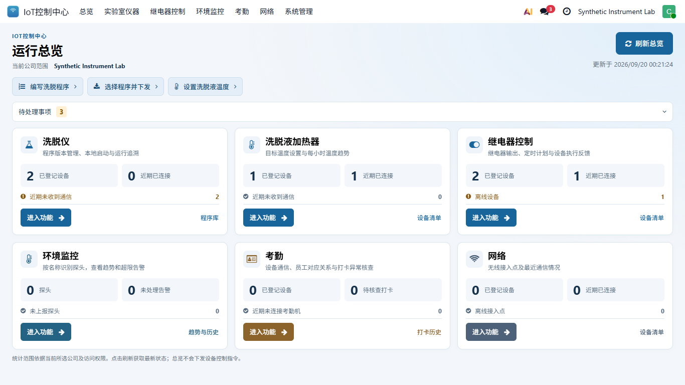
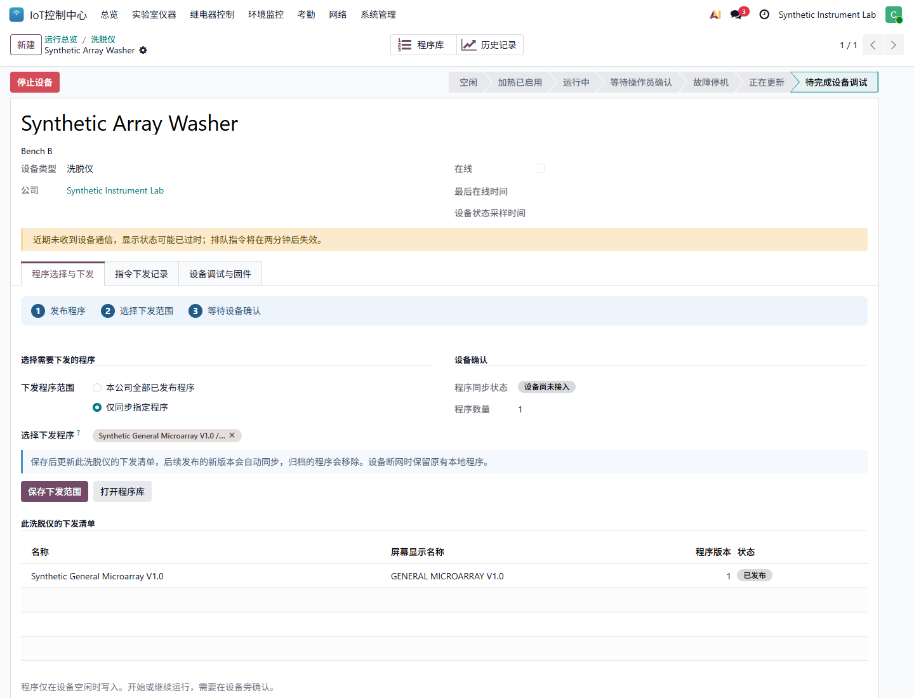

# IoT 19.0.2.4.0: programs and compact workspaces

## 中文操作说明

首页采用紧凑的三列卡片，直接提供“编写洗脱程序”“选择程序并下发”和
“设置洗脱液温度”入口。“待处理事项”默认显示汇总，点击可展开明细；
每类设备的卡片仍直接显示未连接数量。窄屏自动换列，并保留纵向滚动。

程序下发路径：**IoT 控制中心 > 实验室仪器 > 洗脱仪 > 选择下发程序**。

1. 先在同一菜单下的“洗脱程序库”编写、发布程序。
2. 打开目标洗脱仪，选择“本公司全部已发布程序”或“仅同步指定程序”。
3. 如果选择指定程序，在“选择下发程序”中添加程序名称。
4. 核对“此洗脱仪的下发清单”，点击“保存下发范围”。
5. 设备联网且空闲后自动下载。只有“设备已确认当前清单”才表示收到；
   保存成功不等于下发完成，设备也不会因此自动开始运行。

默认仍为全部程序自动同步。指定程序后，新版本仍会自动跟随；归档最新
已发布版本会移除该程序，不回退旧版。断网时设备保留原有本地程序。
操作员可选择下发范围；编写和发布程序仍需要 IoT 管理员权限。

本次改动不刷固件、不启动洗脱仪、不切换继电器，也不解除安全保护。

以下为隔离库合成数据截图，不是生产设备的状态：

## Find the controls

The top-level menu now groups functions by purpose: Overview, Laboratory
Instruments, Relay Control, Environment, Attendance, Network and Administration.
Existing permissions still apply. Device registration and firmware remain
manager-only; this release does not change outputs, safety locks or firmware.

The overview offers direct links to write washer programs, select a washer's
programs and set buffer temperature. Desktop cards use three columns and the
available window width. Narrow windows stack cards and remain scrollable.

## Choose programs for a washer

1. Open Laboratory Instruments > Washer Program Library. Create or edit a draft,
   then choose Release Program. The screen label must use English characters.
2. Open Laboratory Instruments > Array Washers. Use Select Programs on the card.
3. Choose All company programs (the existing default), or Selected programs and
   select at least one released program from the device's company.
4. Check Programs for This Washer. This table shows the actual latest released
   versions that the washer will receive, not just the version originally selected.
5. Choose Save Program Selection. Changes take effect when the form is saved;
   the device downloads the complete list when connected and idle.
6. Check Program Sync. Only Device confirmed current list means a fresh device
   report contains the expected catalog digest. Platform publication or saving
   the selection alone is not proof of delivery.

Selected programs follow future released revisions automatically. Archiving a
program's latest released revision removes it from the next successful sync,
without restoring an older revision. New program identities are included only
in All company programs unless explicitly selected. An offline washer keeps its
previous local programs. There is no fixed three-program storage limit.

There is no remote start in this workflow. Start and Continue remain local to the
instrument. Commissioning and physical balancing are still required.

## Read the state correctly

- Device not connected yet: no device contact has been recorded.
- Waiting for device contact: contact or sampled state is no longer fresh.
- Automatic sync not reported: the fresh report does not advertise catalog sync.
- Waiting for device sync: the reported catalog does not match the current list.
- Device confirmed current list: fresh reported and expected catalog digests match.
- Program list needs review: validation failed; do not interpret this as an empty list.

## Buffer heaters

Temperature feedback and the requested/stored setpoints remain visible together.
Send Temperature Settings and Heater Alarms are directly accessible; protection
parameters and detailed operating notes are under Heating Protection. Sending a
setpoint does not start heating or clear an alarm.
